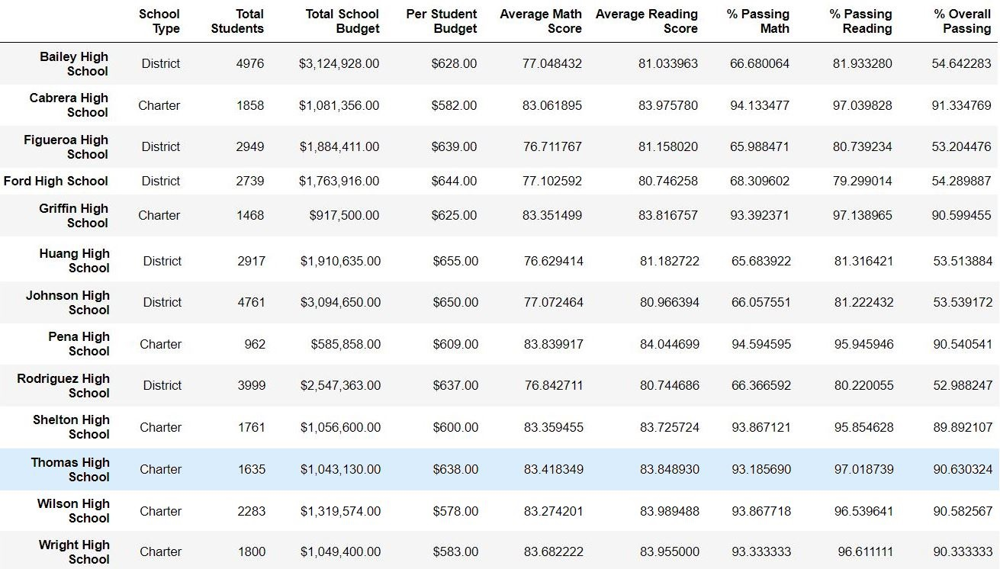

# School_District_Analysis

### Student: Christopher Mastrangelo

## Purpose of this project

We removed the test scores for the 9th grade class at Thomas High School and compared the average scores and percentage rankings for math and reading before and after.  Running an analysis of the test scores for Thomas High School using grades 10-12 only and comparing that to the test scores for 9th grade shows that the average reading and math scores and the percentages of students who passed math and reading remained consistent to within a reasonable margin of error. 

As the code above shows, when you compute the average reading and math scores for upperclassmen only, and compare to the full school incuding freshmen, the average is amost the same, which suggests the 9th grade average scores are consistent with the other classes. Whether you compute the average using 461 freshmen, or 1174 upperclassmen, or combine them together, the average scores are consistent with each other.

As shown below, the ranking of Thomas High School in the top 5 performaing schools does not change whether the 9th grade test scores are included or not.

## Top Performing Schools

The top 5 schools are Cabrera, Thomas, Griffin, Wilson, and Pena.  They are all charter schools.

Note: The percentage columns for Thomas HS do not include the 9th grade test percentages pending an audit of the tests.

## Lowest Performing Schools

The five lowest performing schools are Rodriguez, Figueroa, Huang, Hernandex, and Johnson.  All are "District" schools and have a higher number of students than average.

## Graphics section - this is a summary of graphics/images used in the report

This <a href="https://github.com/gcmastra/School_District_Analysis/blob/main/Resources/imge1_ths_math_scores_null.JPG">
image</a> shows a section of the school_data_complete_df dataframe after the Thomas HS 9th grade math and reading scores have been changed to null 
  

This graphic shows the summary data per school before the Thomas HS 9th grade data has been changed.

Here is a graphic which shows the per school summary frame AFTER the numbers for Thomas HS have been updated.  When 9th grade test scores are excluded from the totals, the average test scores go down slightly.  This does not suggest the 9th grade test scores were fabricated to make the school averages look better. The change in percentages alone is not significant enough to suggest "dishonesty" was the motive. On the contrary they suggest any slight variation in the percentages could have been an honest mistake and perhaps an audit of the tests themselves would reveal the source of the error. 

## Additional Comments (not part of the main report)

### Comments to be included in the Module 4 Survey

In my opinion this was a very difficult challenge assignment. It was very long and had too many steps. I did not enjoy this challenge.

